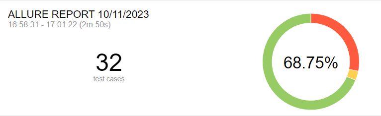
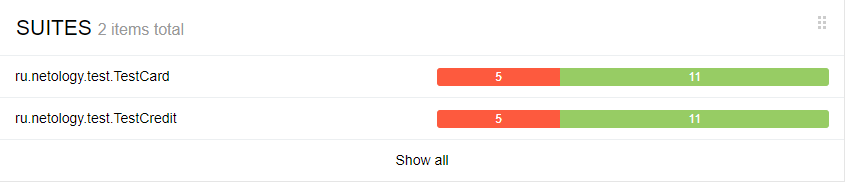

**Отчёт по тестированию**

По ранее составленному плану было произведено тестирование ранее заданного веб-сервиса приобретения тура, а так же приобретения тура в кредит.
Во время автоматизации были произведены, как позитивные, так и негативные тесты. 

**Тестовые кейсы**

Всего было составлено 32 тестовых сценария, для каждой из функции покупки тура.
  • покупка при оплате банковской картой (1 - позитивный сценарий, 15 - негативных)
  • покупка в кредит по данным банковской карты (1- позитивный сценарий, 15 - негативных)

**Результаты тестирования**

Тесты были проведены со следующими результатами.

68.75% - успешно пройденных тестов, 31,25 - не пройденных тестов.

**Итого**

Исходя из результатов тестирования нужно исправить [дефекты](https://github.com/DimkaIscariah/QADiplom/issues) в приложении и составить необходимый мануал.

